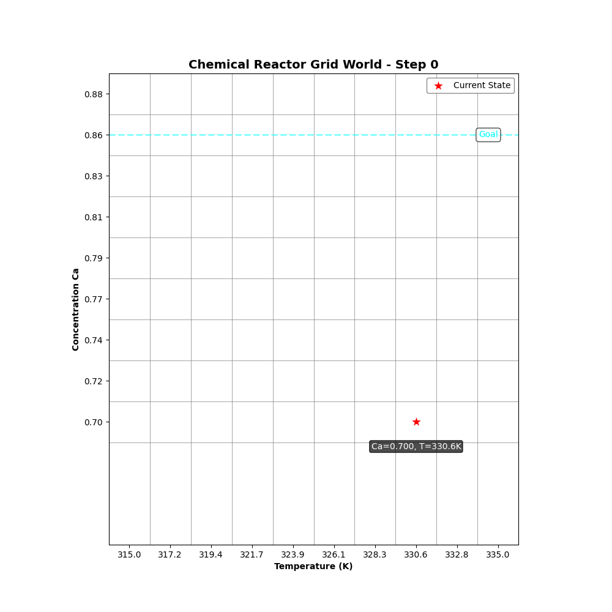

# chemengRL 🎓
Educational notebooks of the reinforcement learning algorithms tabular Q-learning and DQN for chemical engineering applications.

<div align="center">
  
</div>

## Getting Started

### Clone the Repository
To get started, clone the repository from GitHub:
```bash
git clone https://github.com/MaximilianB2/chemengRL.git
cd chemengRL
```

### Set Up the Environment
Install the required environment using Conda:
```bash
conda env create -f practical_rl.yml
conda activate chemengRL
```

### Notebooks for Reactors
The notebooks for the discretised chemical reactor and the continuous reactor can be found in the `src` directory.


