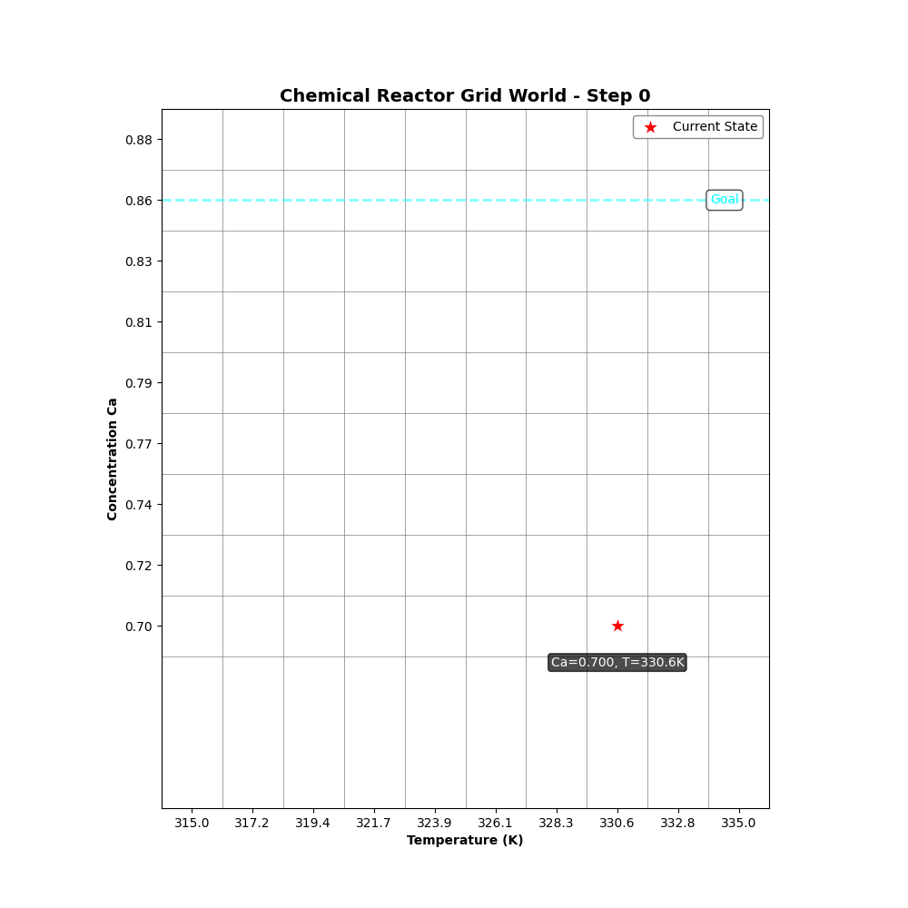

# chemengRL 🎓
Educational notebooks of the reinforcement learning algorithms tabular Q-learning and DQN for chemical engineering applications.

<div align="center">
  
</div>

## Getting Started

### Clone the Repository
To get started, clone the repository from GitHub:
```bash
git clone https://github.com/MaximilianB2/chemengRL.git
cd chemengRL
```

### Set Up the Environment

You can use either Conda or the built-in Python venv.

#### Option A: Conda
```bash
conda env create -f practical_rl.yml
conda activate prac_rl
```

#### Option B: Python venv (Windows and macOS/Linux)

macOS/Linux:
```bash
python3 -m venv .venv
source .venv/bin/activate
pip install -r requirements.txt

# Optional: make the venv available in Jupyter
python -m ipykernel install --user --name chemengrl-venv --display-name "Python (chemengRL)"
```

Windows (PowerShell):
```powershell
py -3 -m venv .venv
.venv\Scripts\Activate.ps1
pip install -r requirements.txt

# Optional: register the kernel for Jupyter
python -m ipykernel install --user --name chemengrl-venv --display-name "Python (chemengRL)"
```

Windows (Cmd):
```bat
py -3 -m venv .venv
.venv\Scripts\activate.bat
pip install -r requirements.txt
```

To deactivate the venv later, run `deactivate`.

### Notebooks for Reactors
The notebooks for the discretised chemical reactor and the continuous reactor can be found in the `src` directory.

Start with the tabular setting (`src/TabularQlearning.ipynb`)first then move onto the more complex DQN notebook (`src/DQN.ipynb`).


